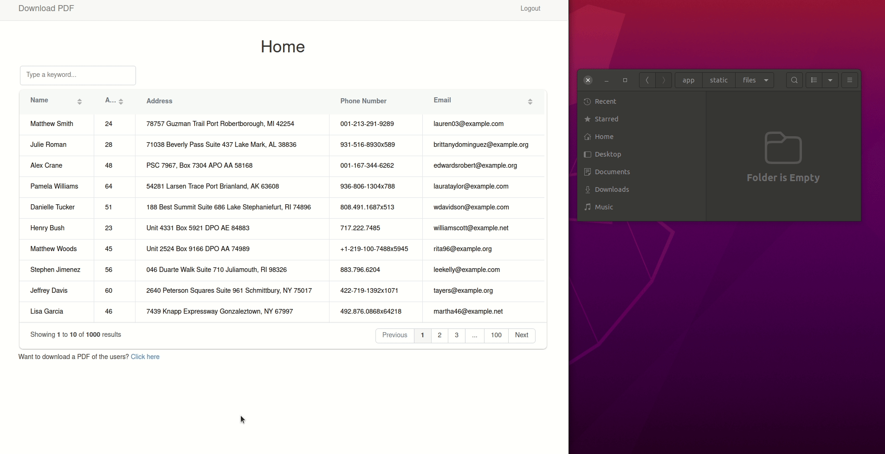

# Encrypt Downloaded Copy of Users Data Using Python and Flask

Encryption is a key security feature that prevents unauthorized access to personal data. This project highlights how a user of an application can download their data and encrypt it.





## Technologies Used

- Flask
- Python for programming
- Flask SQLAlchemy and Flask Migrate (for database management)
- Faker for generating fake data
- FPDF for generating PDFs
- PyPDF2 for encrypting PDFs
- Grid.js for table generation


## Features

- Generation of PDF file 
- Encryption of PDF file
- Autogeneration of users data

## Creating and downloading a PDF

The `fpdf` package is used to generate the PDF file. To see how `fpdf` works, consider this very minimalist example:

```python


from fpdf import FPDF


pdf = FPDF()
pdf.add_page()
pdf.set_font('Arial', size=12)
pdf.cell(200, 10, txt='Hello World!', ln=1, align='C')
pdf.output('hello.pdf', 'F')

```

You create an FPDF object which is used to add a page to the PDF. You then set the font and add the text to the page. In this case, the word to be displayed is "Hello World!". A few parameters are used when displaying this text. Finally, you save the PDF to a file.


## Encryption of PDF


The `pyPDF2` package is used to encrypt the PDF file. To see how `pyPDF2` works, consider this very minimalist example:

```python


from PyPDF2 import PdfFileWriter, PdfFileReader


pdf = PdfFileReader(open('hello.pdf', 'rb'))
pdf_writer = PdfFileWriter()


for page in range(pdf.numPages):
    pdf_writer.addPage(pdf.getPage(page))
    pdf_writer.encrypt('rosebud')
    with open('encrypted.pdf', 'wb') as f:
        pdf_writer.write(f)
    f.close()
```


You create a PdfFileReader object which is used to read the PDF file. The PdfFileWriter object is used to write the PDF file. You then add the pages to the PdfFileWriter object before encrypting the file using the `encrypt` method. Finally, you save the encrypted PDF to a file.


## Contributors

[](https://github.com/GitauHarrison/download-encrypted-pdf-copy-of-user-data/graphs/contributors)


## Testing the Application Locally

1. Clone this repository

```python
git clone git@github.com:GitauHarrison/download-encrypted-pdf-copy-of-user-data.git
```

2. Go to the directory

```python
$ cd download-encrypted-pdf-copy-of-user-data
```

3. Create and activate a virtual environment

```python
$ mkvirtualenv venv
```

4. Install project dependancies

```python
(venv)$ pip3 install -r requirements.txt
```

5. Run the application

```python
(venv) flask run
```

6. Open the browser and navigate to http://localhost:5000/

## Learning

If you are curious about this feature, learn how you can incorporate it in your next flask application [here](https://github.com/GitauHarrison/notes/blob/master/download_encrypted_pdf.md).